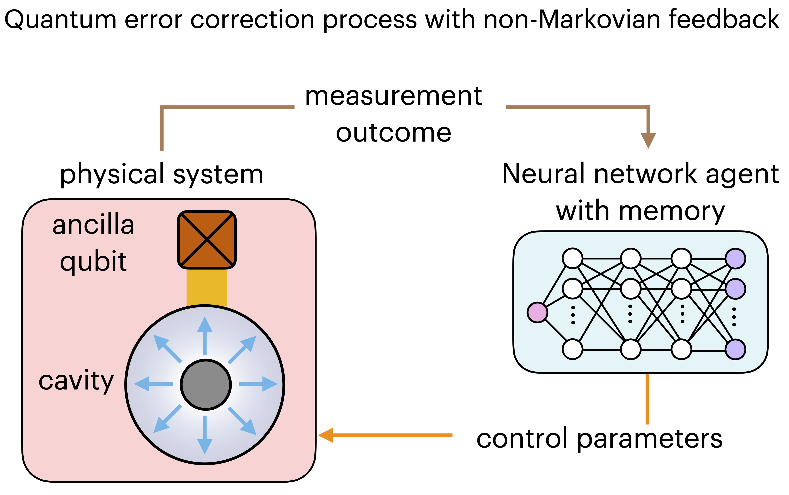
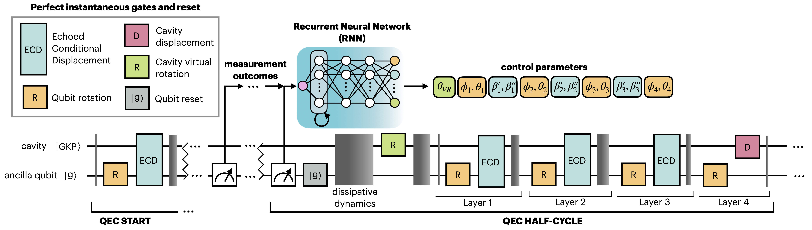

# GQF - Gottesmann-Kitaev-Preskill code Quantum error correction with Feedback-GRAPE.
[](https://arxiv.org/abs/2312.07391)

Code repository for quantum error correction with non-Markovian Feedback on the Gottesmann-Kitaev-Preskill code with model-based Feedbakc-GRAPE approach.

- [Overview](#overview)
- [Installation](#installation)
- [Description](#description)
- [License](#license)
- [Citation](#citation)
- [References](#references)


## Overview

The library can be used to train a neural network to suggest the parameters of the gate sequence of the small-BIG-small protocol [1] for quantum error correction on a physical GKP code. It is possible to use either a feed-forward neural network, or a recurrent neural network: this latter provides the non-Markovian feedback which is the main result of our work. 

<p align="center">
  
</p>
<p align="center">
  <em> Scheme of the proposed quantum error correction process via non-Markovian feedback, using a recurrent neural network. </em>
</p>

The protocol used is the so-called small-BIG-small (sBs) with measurements as introduced in Ref. [1]. The library allows to ismulate the noisy dynamics of cavity and qubit, subject to cavity dissipation and ancillary qubit relaxation and dephasing. It is also possible to choose different dynamics (gate and qubit's reset time durations) as well as different noise intensity (such as thohse in Ref.s [1] and [2]). The training of the neural network is performed using the model-based Feedback-GRAPE algorithm of Ref. [3].

<p align="center">
  
</p>
<p align="center">
  <em> Quantum error correction feedback small-BIG-small protocol with on-line recurrent neural network. </em>
</p>

## Installation

1. Clone the repository

``` bash
git clone https://github.com/Matteo-Puviani/GQF.git
cd GQF
```

2. Install requirements
``` bash
pip install -r requirements.txt
```

## Description

The codes are locate inside the GQF folder:

- runner.py is used to run the code, such as for training or evaluating the neural network agent 
- GKP_environment.py creates the environment for the GKP code, including the hardware simulator
- feedback_GRAPE.py implements the Feedback-GRAPE protocol with gradient ascent 
- mesolve.py solves the Lindblad master equation for the noisy time evolution of the system
- operators.py contains the operators (e.g.: gates) used in the environment
- qutils.py contains some utility functions 


## License

The code in this repository is released under the MIT License.


## Citation
``` bib
@article{puviani_gkp_2023,
  title={Boosting the Gottesman-Kitaev-Preskill quantum error correction with non-Markovian feedback},
  author={Puviani, Matteo and Borah, Sangkha and Zen, Remmy and Olle, Jan and Marquardt, Florian},
  url = {http://arxiv.org/abs/2312.07391},
  journal={arXiv preprint arXiv:2312.07391},
  publisher = {arXiv},
  month = dec,
  year = {2023},
  note = {arXiv:2312.07391 [quant-ph]},
}
```


## References
[1] Sivak, V.V., Eickbusch, A., Royer, B. et al., "Real-time quantum error correction beyond break-even", Nature 616, 50–55 (2023), https://doi.org/10.1038/s41586-023-05782-6

[2] Campagne-Ibarcq, P., Eickbusch, A., Touzard, S. et al., "Quantum error correction of a qubit encoded in grid states of an oscillator", Nature 584, 368–372 (2020), https://doi.org/10.1038/s41586-020-2603-3

[3] Riccardo Porotti, Vittorio Peano, and Florian Marquardt, "Gradient-Ascent Pulse Engineering with Feedback", PRX Quantum 4, 030305 (2023), https://link.aps.org/doi/10.1103/PRXQuantum.4.030305
